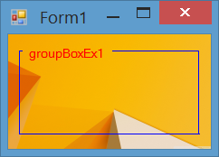

#Custom GroupBox (Support BorderColor, TextColor, Transparent BackColor)

In this example, I've created a custom group box having following features:

- It supports transparent `BackColor`. If you set its `BackColor` to `Transparent` then it will show background of the parent.
- Is has a `BorderColor`. So you can set the color of border for the control.
- It has a `TextColor` property which allows you to set the text color for the control. 

**Some notes:**

- The GroupBox control supports transparent background unless you use System as FlatStyle.

- Using `ForeColor` property of `GroupBox` to render the title of control may be annoying because `ForeColor` is an ambient property and will be inherited by child controls. So I created another property like `TextColor` for this purpose. (Children of group box will use fore color of group box by default, unless you change their fore color property.)